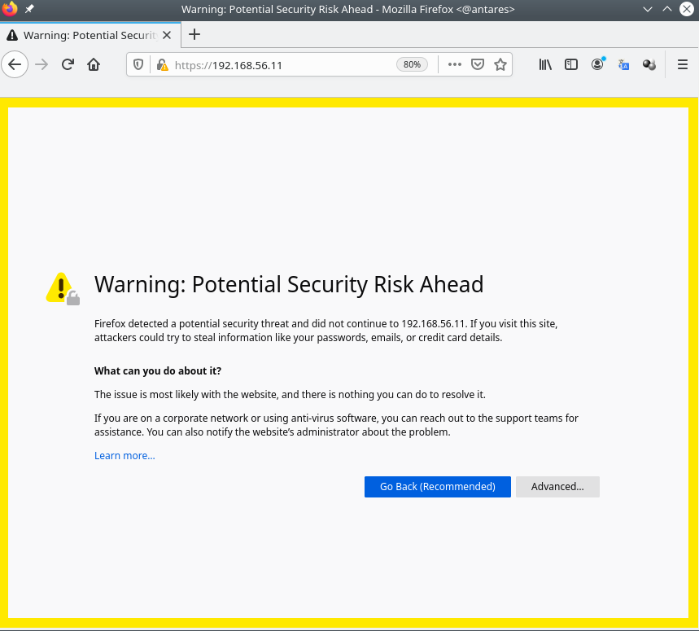
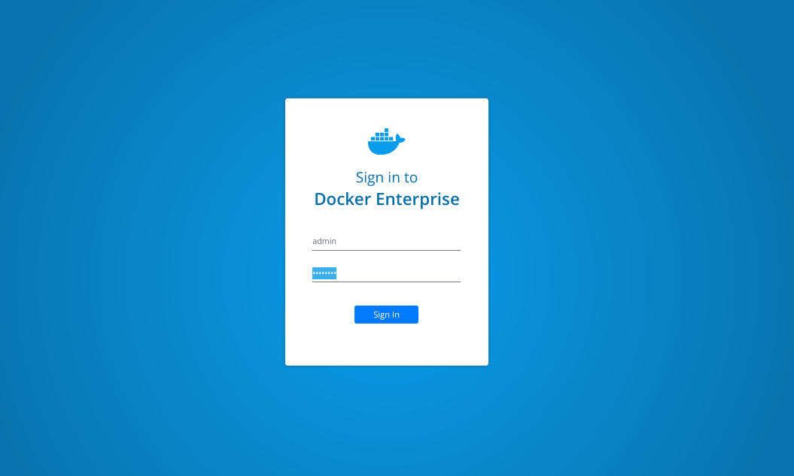

# Chapter 12

# Chapter 11

## Previous requirements
In this chapter we will learn Docker Swarm orchestrator features. We provide some labs at the end of the chapter that will help you understand and learn shown concepts. These labs can be run on your laptop or PC using the provided vagrant Docker Enterprise environment or any already deployed Docker Enteprise cluster at your own. Check additional information in this book's github code repository available in this link https://github.com/PacktPublishing/Docker-Certified-Associate-DCA-Exam-Guide.git.

You will need at least (all labs were tested on Linux and Windows):

    - Internet connection.
    - Some Linux, MacOS or Windows basic skills to edit files (using Notepad, Vim, Emacs or any other editor).
    - Git command-line, Vagrant and Virtualbox installed on your PC or laptop.
    - Already cloned book' s repository https://github.com/PacktPublishing/Docker-Certified-Associate-DCA-Exam-Guide.git.
    - Enough hardware resources: 2vCPU, 6GB of RAM per node (4 nodes) and 120 GB of available disk space on your hard drive for all nodes.

Extended instructions can be found on Github book's repository. These labs will use "environments/enterprise" folder for the creation of the virtual environment and "chapter8" folder.
>NOTE: To clone book' s repository https://github.com/PacktPublishing/Docker-Certified-Associate-DCA-Exam-Guide.git, prepare a directory on your laptop or PC and execute git clone https://github.com/PacktPublishing/Docker-Certified-Associate-DCA-Exam-Guide.git. This will download all required files on your current folder.

All labs will start executing vagrant up  using your command-line from the environment directory "environments/enterprise". This command will start all the required nodes for you. If you are using your own Docker Enterprise cluster, you can use "chapter12" folder. Ask your Docker administrator for the cluster-required credentials for your environment to execute the provided labs.

Once all environment nodes are up and running, go to "chapter12" folder and follow each lab instructions.

After completed the labs (__chapters 12 and 13 labs require a running UCP environment__), you can use vagrant destroy -f from "environments/enterprise" directory to completely remove all the lab-deployed nodes and free your disk.

### Following labs can be found under chapter12 directory.


---

Before starting these labs, ensure all your nodes are up and running using _vagrant status_.

```
Docker-Certified-Associate-DCA-Exam-Guide/environments/enterprise$ vagrant status
--------------------------------------------------------------------------------------------
 DOCKER ENTERPRISE Vagrant Environment
 Engine Version: current
--------------------------------------------------------------------------------------------
Current machine states:

enterprise-node1          running (virtualbox)
enterprise-node2          running (virtualbox)
enterprise-node3          running (virtualbox)
enterprise-node4          running (virtualbox)

This environment represents multiple VMs. The VMs are all listed
above with their current state. For more information about a specific
VM, run `vagrant status NAME`.
 ```
---
>__NOTE: These labs require an already running Docker Entreprise platform. It is recommended to execute these labs after chapter11 because we learned in that chapter how to deploy Docker Entperise platform. If you have not destroyed your enterprise labs environment, you wil have a Docker Enteprise platform already to deploy these labs.__
---


## __Lab1__: Enable Interlock and verify its components.

In this lab we will enable Interlock on Docker Enterprise cluster and we will review its components. Interlock's components were described in chapter 12.

>__NOTE: For easy access, add "192.168.56.11 ucp.vagrant.labs" to your hosts file.__This will help us accessing UCP directly. We prepared the environment with internal resolution. It will work for you.

1 - Connect to our already deployed Docker Enterprise's UCP's Web UI. If you are using the provided Vagrant environment your UCP Web UI will be accesible in https://ucp.vagrant.labs (we haven't used any external load balancer for these labs, therefore this FQDN points to first node's IP address). If you haven't changed installation's "admin" user's password it will be "changeme". We will get into "admin" > "Admin Settings" configuration settings. Notice that "Admin Settings" menu will be available to any UCP's administrator user. In fact you will find these settings inside each administrator's username menu.

You will get a warning message because we are using autosigned-certificates if you didn't accept them yet. We will trust this certificate or simple follow your browser instructions to accept the risk and continue to our UCP's URL.



Login page will appear and we will use "admin" username and its password (defined during installation).



We will have access to UCP's Dashboard.


We will click on admin's username and we will get into "Admin Settings" endpoint.


Then we will navigate to "Layer 7 Routing (Interlock)" features and we will enable "Layer 7 Routing"


